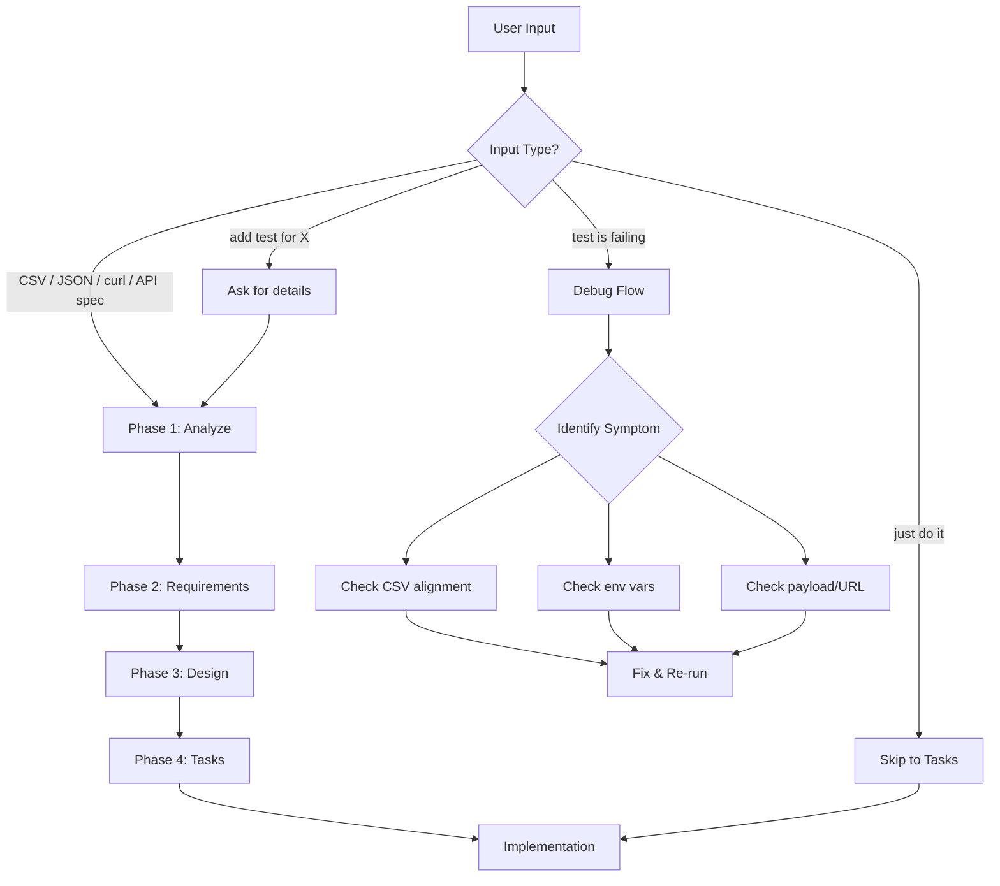
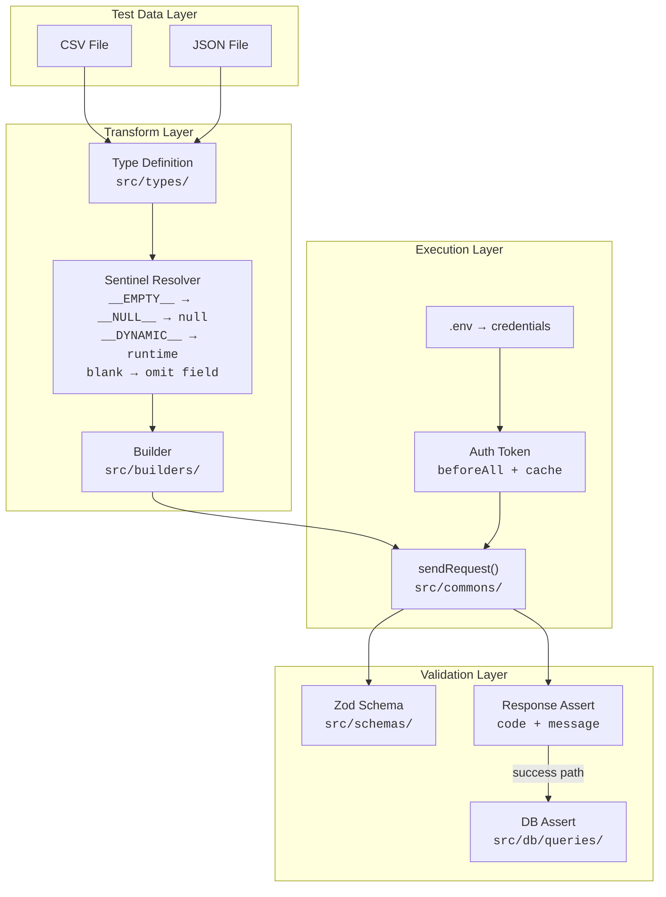
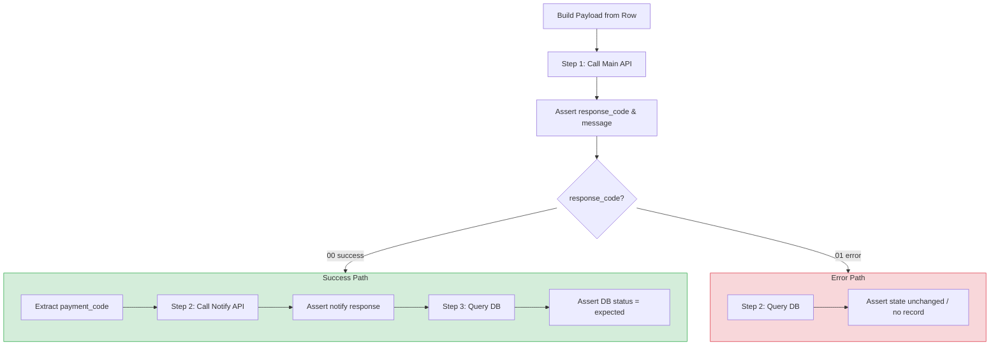
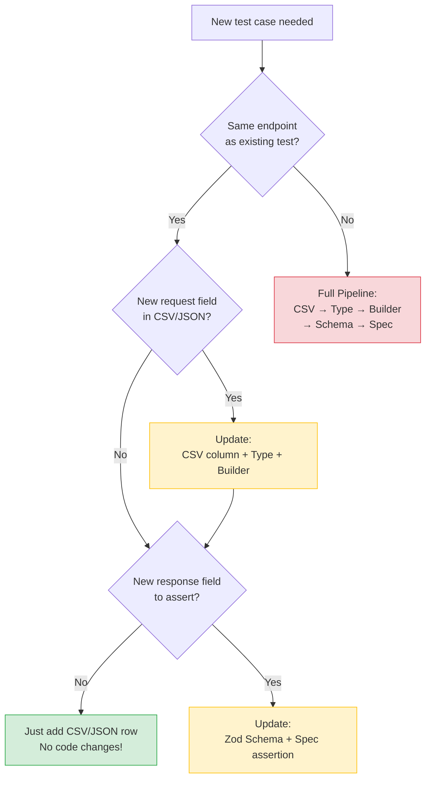
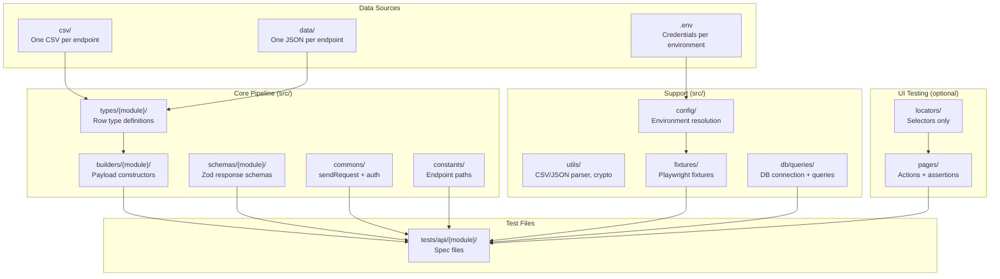
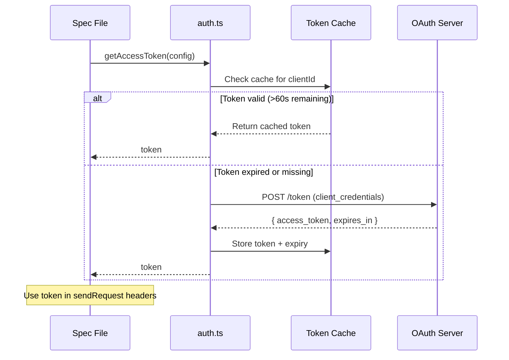
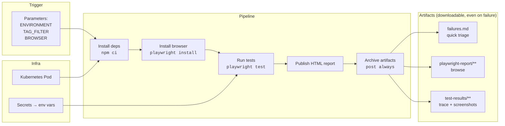

# DIAGRAMS — Visual Workflow & Architecture

Visual diagrams for the qa-automation skill. See [SKILL.md](./SKILL.md) for detailed rules and [REFERENCE.md](./REFERENCE.md) for code templates.

> **Domain examples are illustrative.** Some diagrams use payment-style specifics (response codes `00`/`01`, `payment_code`, a notify step) as concrete examples. The flow *structure* is what generalizes — substitute your own codes, resource IDs, and follow-up calls.

---

## 1. Skill Activation Flow

What happens when the skill is triggered:

---

## 2. Workflow Phases

The four-phase process before writing any code:

```mermaid
flowchart LR
    subgraph Phase1[Phase 1: Analyze]
        A1[Identify endpoint]
        A2[Request fields]
        A3[Response fields]
        A4[Error cases]
    end

    subgraph Phase2[Phase 2: Requirements]
        R1[Acceptance criteria]
        R2[SHALL language]
        R3[Pipeline order]
    end

    subgraph Phase3[Phase 3: Design]
        D1[Architecture flow]
        D2[Decision logic]
        D3[Files to create/modify]
        D4[Override/injection pattern]
    end

    subgraph Phase4[Phase 4: Tasks]
        T1[Checkboxes ordered by pipeline]
        T2[Each references requirement]
        T3[Implementable steps]
    end

    Phase1 -->|User approves| Phase2
    Phase2 -->|User approves| Phase3
    Phase3 -->|User approves| Phase4
    Phase4 -->|User approves| IMPL[Start coding]
```

---

## 3. Data Pipeline Architecture

How data flows from test data through each layer to assertions:

---

## 4. Multi-Step Branching Flow

How multi-step tests branch based on response:

---

## 5. Decision Tree: Do I Need Code Changes?

When adding a new test case, decide what needs to change:

---

## 6. Project Structure Overview

---

## 7. Authentication & Token Lifecycle

---

## 8. CI/CD Pipeline

---

## Diagram Legend

| Symbol | Meaning |
|--------|---------|
| 🟢 Green box | Easy / no code changes |
| 🟡 Yellow box | Partial code changes |
| 🔴 Red box | Full pipeline changes needed |
| Diamond | Decision point |
| Rectangle | Action or process |
| Subgraph | Logical grouping |
